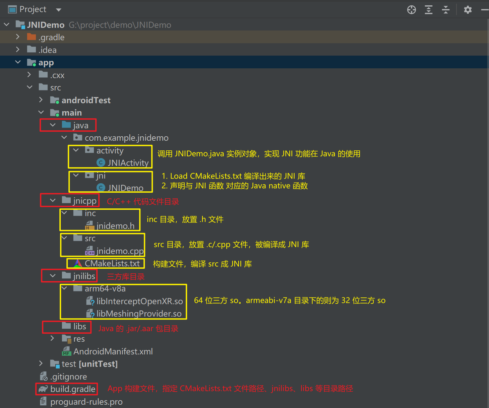
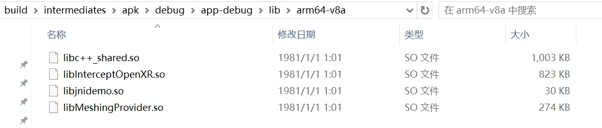

JNI（Java Native Interface），定义了使用 Java 或 Kotlin 编程语言编写编译的字节码与原生代码（使用 C/C++ 编写）进行交互的方法。

JNI Demo App 实现了一个字符串在 JNI 和 Java 之间的传递，而且能够加载三方库和 C/C++ 文件。


# 自定义 JNI App 架构

## 目录架构



JNI Demo 的目录结构注意点：

- Load JNI so 以及 native 函数声明部分需要单独抽离出来，写成一个专门的 JNIDemo.java，便于对 JNI 的调用
- 与 java 目录平级新建 jnicpp 目录放置 C/C++ 源码文件
- 与 java 目录平级新建 jnilibs 目录放置需要加载的三方库
- CMakeLists.txt 位置，放置在 jnilibs 根目录


# build.gradle

build.gradle 的 android { } 中需要指定 jnilibs 和 CMakeLists.txt 两个路径

```kotlin
android {
     
    ...
    
    sourceSets {
        main{
            jniLibs.srcDirs = ['src/main/jnilibs']
        }
    }
 
    externalNativeBuild {
        cmake {
            path file('src/main/jnicpp/CMakeLists.txt')
            version '3.18.1'
        }
    }
    
    ...
    
}
```

如果要导入第三方库，**CMake**在编译时，会默认在**jniLibs.srcDirs**目录下查找和编译如下**4个**主流平台的库，如果这**4个**平台的库没有配置全，编译就会报错。

- arm64-v8a
- armeabi-v7a
- x86
- x86_64

通常我们只会配置移动端 64位的库，也就是 arm64-v8a

所以需要在**build.gradle :: android{} :: defaultConfig{}**里加上如下代码进行过滤

```kotlin
android {
    
    ...
 
    defaultConfig {
 
        ...
 
        externalNativeBuild {
            cmake {
                abiFilters "arm64-v8a"
                arguments "-DANDROID_STL=c++_shared", "-DANDROID_ARM_NEON=TRUE"
                //arguments "-DANDROID_STL=c++_static", "-DANDROID_ARM_NEON=TRUE"
            }
        }
    }
 
    ...
 
}
```

 

# CMakeLists.txt

## 基础的 CMakeLists.txt

```kotlin
# 设置CMake版本
cmake_minimum_required(VERSION 3.18.1)
 
# 设置变量
set(jnicpp_src "${CMAKE_SOURCE_DIR}/src")    #src源码路径
set(jnicpp_inc "${CMAKE_SOURCE_DIR}/inc")    #inc头文件路径
set(jnilibs_dir "${CMAKE_SOURCE_DIR}/src/main/jnilibs")  #so/.a
 
# 1.创建和命名库，本demo里是要生成的库jnidemo.so
# 2.设置要生成的库的属性：STATIC(.a) 或 SHARED(.so)
# 3.设置生成库的源码路径
# 4.可以定义多个库，CMake都会进行编译，Gradle再自动将库打包到Apk
add_library(
        jnidemo    #设置so文件名称
        SHARED     #设置这个so文件为共享
        ${jnicpp_src}/jnidemo.cpp)   #源码路径
 
#指定需要使用的公共NDK库
find_library(
        log-lib  # 设置路径变量名称
        log)     # 指定需要CMake去搜寻定位的公共NDK库
 
#链接头文件
target_include_directories(
        jnidemo    #Jni库
        PRIVATE    #对外引用属性
        ${jnicpp_inc})  #头文件路径
 
#包含头文件
#这个方法与target_include_directories()不同
#设置后，当前目录的所有子目录中的CMakeLists.txt头文件包含都会引用该方法中的变量定义
#include_directories(${jnicpp_inc})
 
# 指定需要用CMake链接到目标库的库。
# 可以链接多个库，例如在本脚本中定义的库、预构建的第三方库或系统库。
target_link_libraries(
        jnidemo     #指定目标库
        ${log-lib}  # 链接NDK中的log-lib库到目标库
)
```

编译项目生成 apk，将 apk 改成 zip 后解压，可以看到 lib 文件夹下有arm64-v8a、armeabi-v7a、x86、x86_64

这四个对应文件夹。

进入64位移动端的**arm64-v8a**目录，可以看到  jnicpp 目录中 C/C++ 源文件生成的 so，以及 jnilibs 目录中导入的第三方 so。



一个能够加载**第三方库**和**C/C++文件**的**Jni App**基本成型了

但是，对于要导入的**第三方库**，这个最基础的**CMakeLists.txt**能做到的仅仅只是把它们加载到了**Apk**中，如果**JNI**代码中需要引用到**三方库**里的方法，那么在**CMakeLists.txt**里还需要对**三方库**进行设置和链接，将它们链接到最终会编译生成的**Jni库**上。

## 链接三方库的 CMakeLists.txt

```kotlin
# 设置CMake版本
cmake_minimum_required(VERSION 3.18.1)
 
# 设置变量
set(jnicpp_inc "${CMAKE_SOURCE_DIR}/inc")    # jnicpp/inc头文件目录路径
set(jnicpp_src "${CMAKE_SOURCE_DIR}/src")    # jnicpp/src源文件目录路径
 
# CMake所有内置变量都只能到CMakeLists.txt所在目录路径，下面方式可以获取CMakeLists.txt所在目录的上一级目录路径
string(REGEX REPLACE "(.*)/(.*)" "\\1" CMAKE_UP_PATH  ${PROJECT_SOURCE_DIR})
set(jnilibs_dir "${CMAKE_UP_PATH}/jnilibs")  ##jnilibs目录路径 so/.a
 
# 1.使用add_library命令创建和命名要生成的jni库，本demo里要生成的是jnidemo.so
# 2.设置要生成的库的属性：STATIC(.a) 或 SHARED(.so)
# 3.设置生成库的源码路径
add_library(
        jnidemo    #设置so文件名称
        SHARED     #设置这个so文件为共享
        ${jnicpp_src}/jnidemo.cpp)   #源码路径
 
#查找指定需要使用的公共NDK库
find_library(
        log-lib  # 设置路径变量名称
        log)     # 指定需要CMake去搜寻定位的公共NDK库
 
# 使用add_library命令，通过指定IMPORTED选项表明这是一个要导入的库文件
# 相当于告知CMake,我要链接三个SHARED动态库：aaa、bbb、ccc
# 这三句必须在前面，要不然后面的语句不知道aaa、bbb、ccc是什么
add_library(aaa SHARED IMPORTED)
add_library(bbb SHARED IMPORTED)
add_library(ccc SHARED IMPORTED)
 
# CMake属性设置函数，IMPORTED_LOCATION 表示设置目标aaa、bbb、ccc的文件路径属性
# ${CMAKE_SOURCE_DIR}：表示CMakeLists.txt的当前文件夹路径
# ${ANDROID_ABI}：编译时会自动根据CPU架构去选择相应的库
set_target_properties(aaa
        PROPERTIES
        IMPORTED_LOCATION
        "${jnilibs_dir}/${ANDROID_ABI}/libqxrcamclient.so")
 
set_target_properties(bbb
        PROPERTIES
        IMPORTED_LOCATION
        "${jnilibs_dir}/${ANDROID_ABI}/libqxrcoreclient.so")
 
set_target_properties(ccc
        PROPERTIES
        IMPORTED_LOCATION
        "${jnilibs_dir}/${ANDROID_ABI}/libqxrsplitclient.so")
 
#链接头文件目录路径
target_include_directories(
        jnidemo    #Jni库
        PRIVATE    #对外引用属性
        ${jnicpp_inc})  #头文件路径
 
#包含头文件
#这个方法与target_include_directories()不同
#设置后，当前目录的所有子目录中的CMakeLists.txt头文件包含都会引用该方法中的变量定义
#include_directories(${jnicpp_inc})
 
# 指定需要用CMake链接到目标库的库。
# 可以链接多个库，例如在本脚本中定义的库、导入的第三方库或系统库。
target_link_libraries(
        jnidemo     #指定目标库
        ${log-lib}  # 链接NDK中的log-lib库到目标库
        aaa
        bbb
        ccc
)
```


# ToDo

- [Android：JNI实战，理论详解、Java与Jni数据调用-CSDN博客](https://blog.csdn.net/geyichongchujianghu/article/details/135711436)